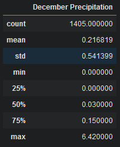
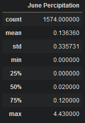

# surfs_up
## Overview
This week we did an analysis over the months of June and December, to determine if the surf and ice cream shop are justified to be open year round for business.
---
## Results
1. The average temperatures in June compared to December are roughly 3 degrees higher.
2. The minimum temperature in June might just be a slow day, but in December it might be a closed day.
3. The 25 percentile in December are more than likely days that would be closed while, the 25 percentile in June is always open.
---
## Summary
The average temperatures in June and December, only being 3 degrees different, is very good news for the shop. It is unlikely that 3 degrees will shut the shop down for any length of time. The minimums are a little different. It is not likely people will want ice cream on a cold day in December, therefore to prevent waste of resources. It is in the companies best interest to close for the day to prevent unnecessary spending. To limit the days the surf shop must close we will look at closing on a week by week baises. The best way to create a predictable envorinment the 25 percentile in december will be the number of days we will say the surf shop is closing on. This is to help prevent slow days where a few people come in, and allow the company to have more predictable revenue numbers. The information gathered is good and helps build an idea of what it will look like when the surf shop opens. December is already going to have less traffic so it is important to analyze how much rain falls in the month of December.
---

I also took the time to look into June and see how it compares. To give us an idea of how many days we might consider a loss and close, and which we would stay open for year round.
---

